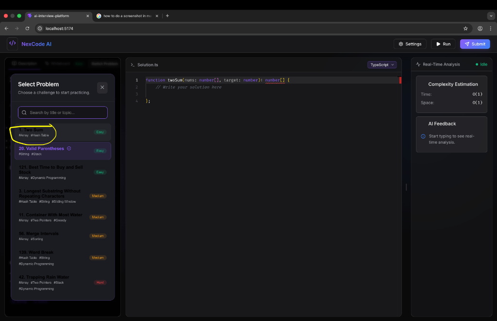
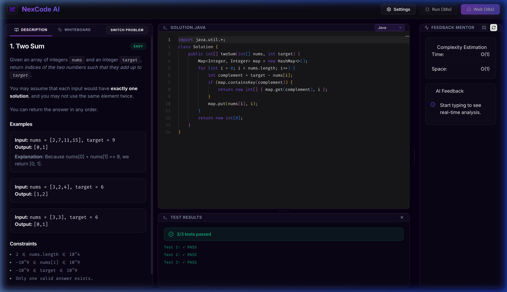
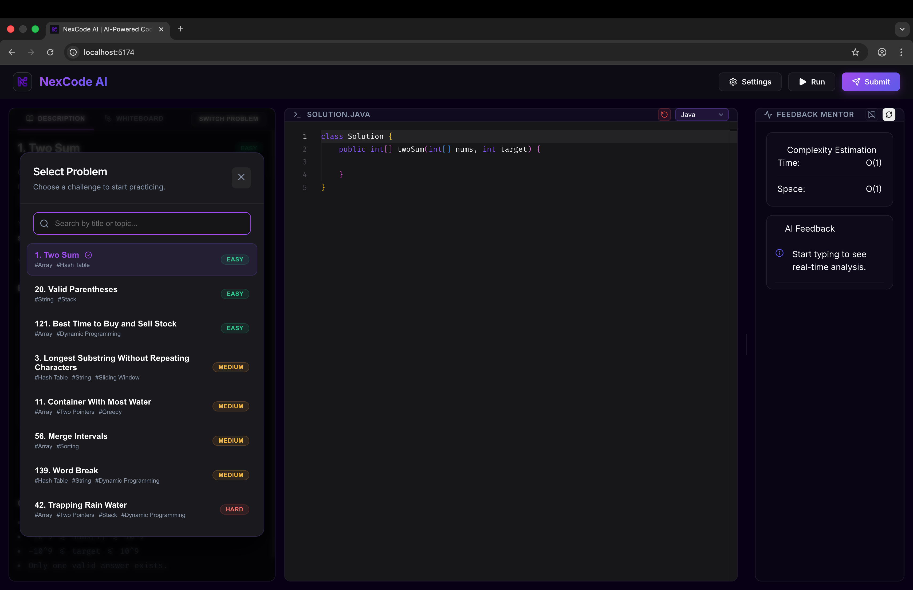
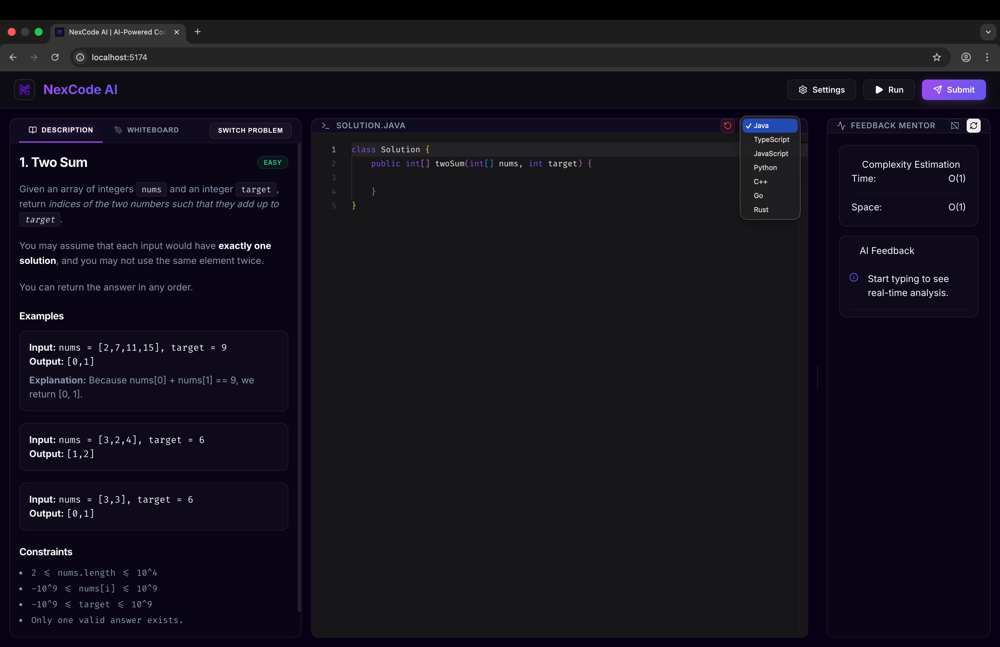
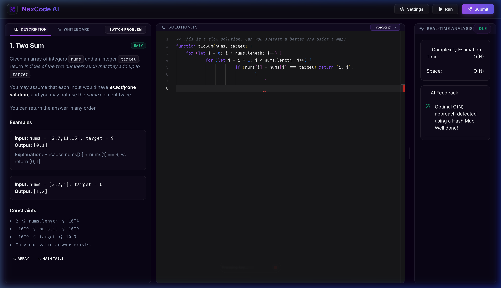

# NexCode AI 🚀
### *The Next-Generation AI-Powered Coding Interview Platform*

NexCode AI is a high-fidelity, premium coding interview preparation platform. It provides candidates with a state-of-the-art environment to practice data structures and algorithms, enhanced by a real-time **AI Mentor** and a **Virtual Execution Engine** powered by Google's Gemini 2.0 Flash architecture.



## 🌟 Key Features

### 🧠 Real-Time AI Mentor
Get instant feedback on your code's time and space complexity as you type. The mentor identifies potential bugs, logic flaws, and optimization opportunities before you even hit "Run". 
- **Smart Isolation:** AI suggestions are automatically paused during code execution to prioritize performance and focus.

### ⚡ Virtual Execution Engine
Execute your solutions across multiple languages (JavaScript, Java, Python, C++, and more) without the need for complex backend infrastructure.
- **Resilient Architecture:** Includes dual-model failover (Gemini 2.0 Flash to Pro) and emergency local fallbacks to ensure test results are returned even when API limits are reached.
- **Quota Protection:** Visual cooldown timers prevent accidental rate-limiting during intense practice sessions.

### 🎨 Premium Developer Experience
- **Glassmorphism Design:** A stunning, modern interface with deep midnight themes and vibrant accents.
- **Monaco Editor Integration:** The same core engine powering VS Code, featuring full syntax highlighting and custom themes.
- **Integrated Whiteboard:** Sketch out ideas and system designs directly within the platform.
- **Subtle Confirmations:** Custom, non-intrusive pop-ups for critical actions like resetting your code.



## 🖼️ Visual Tour

### 📋 Comprehensive Problem Library
Access a curated list of popular coding challenges ranging from Easy to Hard.


### ☕ Multi-Language Support
Seamlessly switch between languages like Java, C++, Python, and TypeScript with intelligent syntax highlighting.


### 🦾 Deep AI Insights
The Feedback Mentor provides granular analysis, identifying specific lines for improvement.


## 🛠️ Tech Stack
- **Frontend:** React 18, Vite, TypeScript
- **Styling:** Vanilla CSS (Custom Glassmorphism Design System)
- **AI/LLM:** Google Generative AI (Gemini 2.0 Flash)
- **Editor:** Monaco Editor (@monaco-editor/react)
- **Icons:** Lucide React

## 🚀 Getting Started

### Prerequisites
- Node.js (v18 or higher)
- A Google Gemini API Key (Available at [Google AI Studio](https://aistudio.google.com/))

### Installation
1. **Clone the repository:**
   ```bash
   https://github.com/shivam24-2000/AI-Powered-Coding-Interview-Preparation-Platform-with-Real-Time-Code-Analysis.git
   ```
2. **Install dependencies:**
   ```bash
   npm install
   ```
3. **Configure Environment Variables:**
   Create a `.env` file in the root directory:
   ```env
   VITE_GEMINI_API_KEY=your_gemini_api_key_here
   ```
4. **Start the development server:**
   ```bash
   npm run dev
   ```

## 🔒 Security Note
The `.env` file is included in `.gitignore` by default. Never share your API key or push it to public repositories.

---

