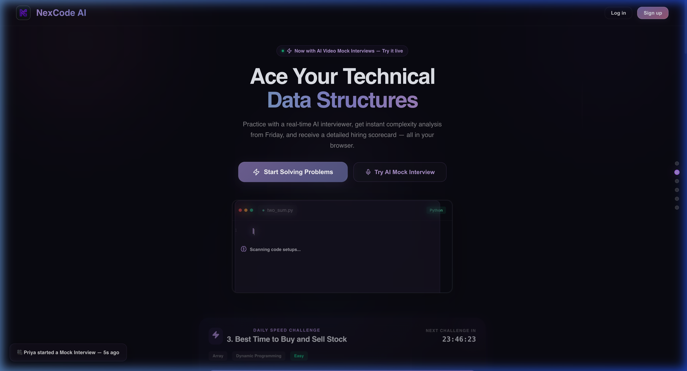
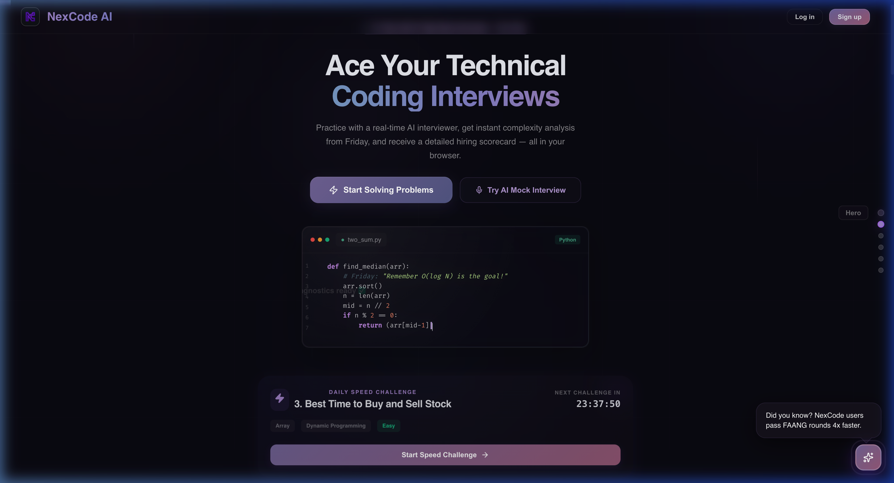
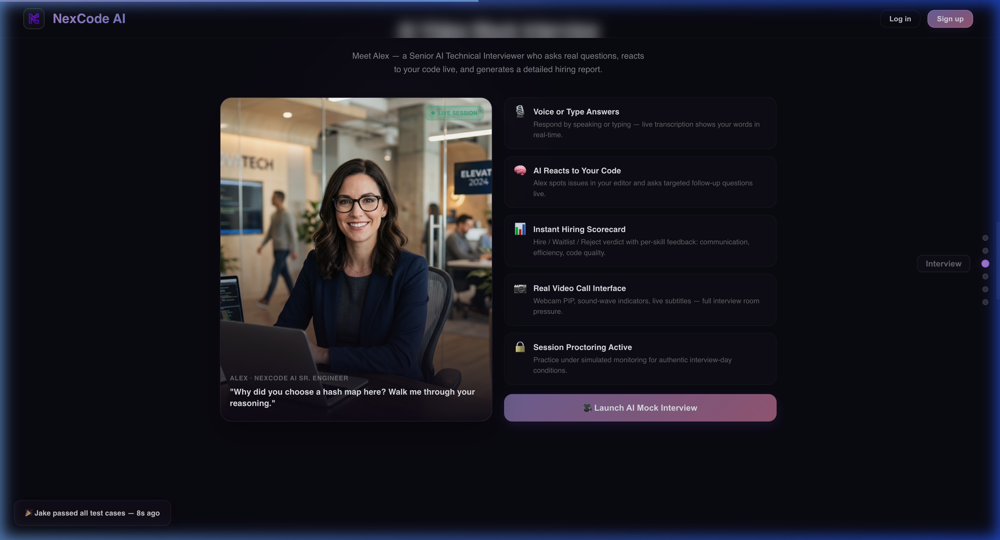
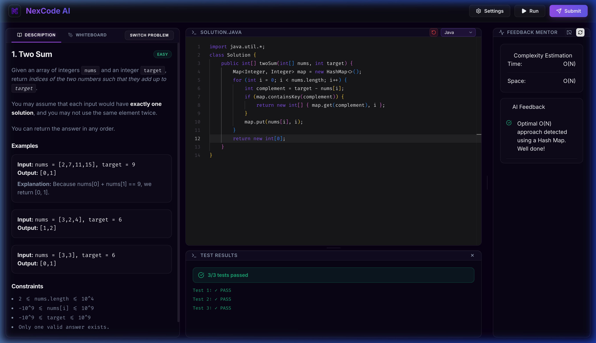
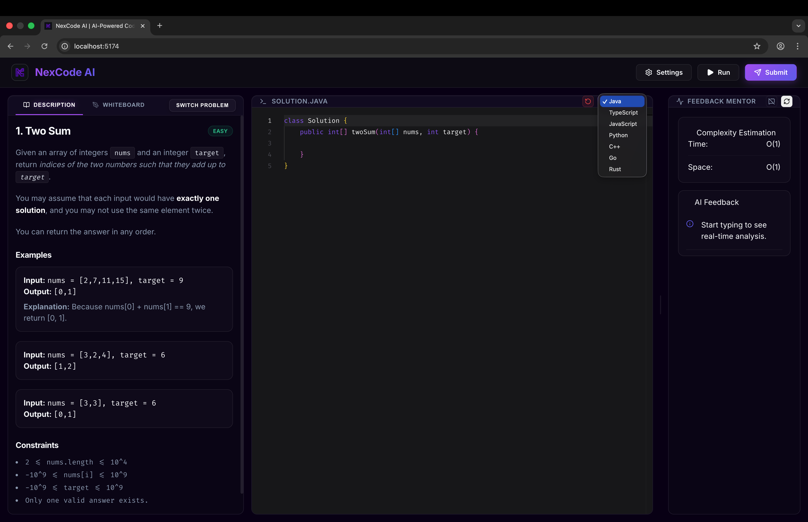
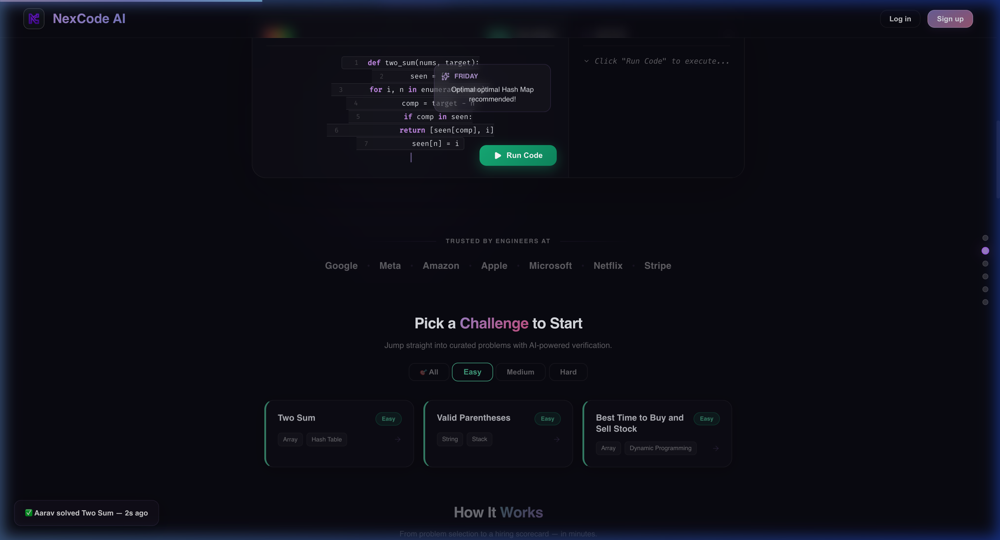
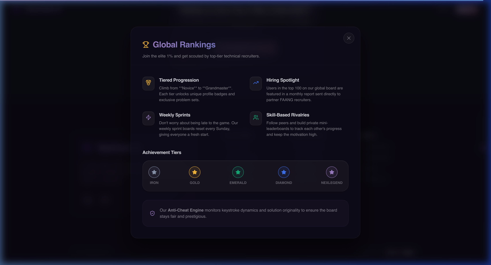
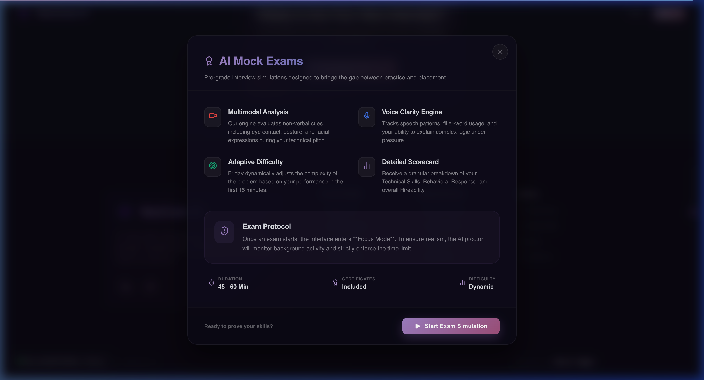

# NexCode AI 🚀
### *The Next-Generation AI-Powered Technical Interview & Code Analysis Platform*

[](https://vitejs.dev/)
[](https://react.dev/)
[](https://www.typescriptlang.org/)
[](https://microsoft.github.io/monaco-editor/)
[](https://aistudio.google.com/)

NexCode AI is a high-fidelity, production-grade technical interview preparation platform. It combines a **VS Code-grade Monaco Editor**, **Language-Aware AI Code Completion (150+ DSA Snippets)**, **Real-Time Complexity Analysis (Friday AI)**, and an interactive **AI Video Mock Interviewer (Alex)** that conducts live technical interviews and generates instant hiring verdicts.

---



---

## 🌟 Key Platform Features

### 🧠 1. Language-Aware AI Code Completion (11+ Languages)
- **150+ DSA Snippet Registry:** Instant autocomplete for Binary Search, DP table initialization, Dijkstra's algorithm, Graph BFS/DFS, LRU Cache, Sliding Window, and Tree Traversals.
- **Multi-Language Support:** Full snippet support for Python, Java, C++, JavaScript, TypeScript, Go, Rust, C#, Swift, Kotlin, and SQL.
- **Toggleable Settings:** Toggle code completions anytime in the Editor Settings modal with zero memory leaks.

### 🎥 2. AI Video Mock Interviewer (Alex)
- **Live Interactive Interviewer:** Face Alex, a Senior AI Technical Interviewer, on a live video call interface.
- **Voice or Type Responses:** Speak your reasoning out loud or type in real time with live speech-to-text transcription.
- **Targeted Follow-Ups:** Alex detects code bottlenecks in your editor and asks live follow-up questions about space/time trade-offs.
- **Hiring Scorecard:** Receive a **Hire / Waitlist / Reject** verdict with per-skill breakdown (Communication, Efficiency, Code Quality).

### 💬 3. Friday Real-Time Complexity Mentor
- **Static Trace Analysis:** Evaluates loops, recursive calls, and hash map lookups in real time.
- **Visual Complexity Gauge:** Live $O(N)$ time & space complexity indicators.
- **Non-Intrusive Guidance:** Provides structural clue tiers without spoiling full solutions.

### 🎮 4. Interactive Hero Skill-Level Quiz & Roadmap
- **10-Second Assessment:** Answer 2 quick questions (Experience Level + Career Goal) directly on the landing page.
- **Custom Roadmap Generator:** Instantly renders a personalized 4-stage practice track with direct quick-launch buttons.

### 🔥 5. Live User Counter & Activity Feed Toast
- **Real-Time Social Proof:** Live animated user counter (`🔴 347 developers practicing right now`).
- **Activity Stream:** Floating activity toasts highlighting recent problem solves, mock interview passes, and streak milestones.

### ⚡ 6. 1-Tap Quick MCQ Knowledge Check
- **Embedded DSA Quiz:** Test your algorithm fundamentals directly on the homepage.
- **Streak Multipliers:** Track consecutive correct answers with live streak counters (`🔥 Streak: 5`).

### 📊 7. Before vs After Performance Analytics
- **Verified Candidate Growth:** Scroll-animated progress bar showing candidate score growth from 42% -> 94% across 3 mock sessions.

### 👥 8. Peer-to-Peer Collaborative Sessions
- **WebRTC & Supabase Sockets:** Practice mock interviews live with a friend using real-time code synchronization and WebRTC video call streams.

---

## 🖼️ Visual Tour

### 🚀 Landing Page & Interactive Platform Preview


### 🎥 AI Video Mock Interviewer (Alex)


### 💻 Monaco IDE & Virtual Execution Engine


### 📊 Multi-Language Support (Java, C++, Python, TypeScript)


### 📚 Comprehensive Problem Bank


### 🏆 Weekly Community Leaderboards


### 🎓 AI Mock Exams Showcase


---

## 🛠️ Technology Stack

| Layer | Technologies Used |
| :--- | :--- |
| **Frontend Core** | React 18, TypeScript, Vite |
| **Styling & Design System** | Vanilla CSS (Dark Midnight & Light Mode Glassmorphism Theme) |
| **Code Editor** | Monaco Editor (`@monaco-editor/react`), Custom Completion Providers |
| **AI / LLM Infrastructure** | Google Generative AI (`@google/genai`), Gemini 2.0 Flash Failover |
| **Icons & Visuals** | Lucide React, HTML5 Canvas Particle Engine |
| **Backend & Realtime** | Supabase Auth, WebRTC P2P Video |

---

## 🚀 Getting Started

### Prerequisites
- **Node.js** (v18.0 or higher)
- **npm** or **yarn**
- **Google Gemini API Key** (Available at [Google AI Studio](https://aistudio.google.com/))

### Installation & Setup

1. **Clone the repository:**
   ```bash
   git clone https://github.com/shivam24-2000/AI-Powered-Coding-Interview-Preparation-Platform-with-Real-Time-Code-Analysis.git
   cd AI-Powered-Coding-Interview-Preparation-Platform-with-Real-Time-Code-Analysis
   ```

2. **Install dependencies:**
   ```bash
   npm install
   ```

3. **Configure Environment Variables:**
   Create a `.env` file in the root directory:
   ```env
   VITE_GEMINI_API_KEY=your_gemini_api_key_here
   VITE_SUPABASE_URL=your_supabase_url_here
   VITE_SUPABASE_ANON_KEY=your_supabase_anon_key_here
   ```

4. **Start Development Server:**
   ```bash
   npm run dev
   ```
   Open `http://localhost:5173` in your browser.

5. **Build for Production:**
   ```bash
   npm run build
   ```

---

## 🔒 Security Note
Never commit your `.env` file or publicize your private API keys. `.env` is included in `.gitignore` by default.

---
Developed with ❤️ by **Shivam Singhal**
